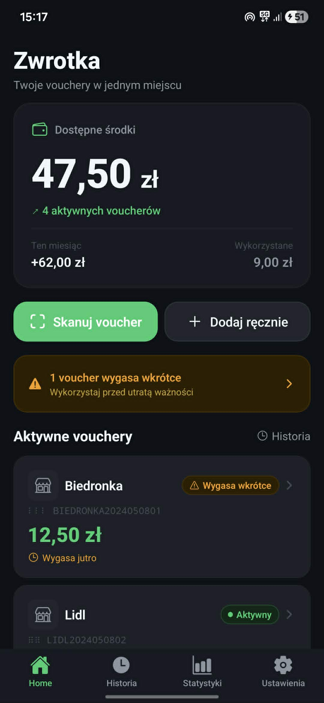
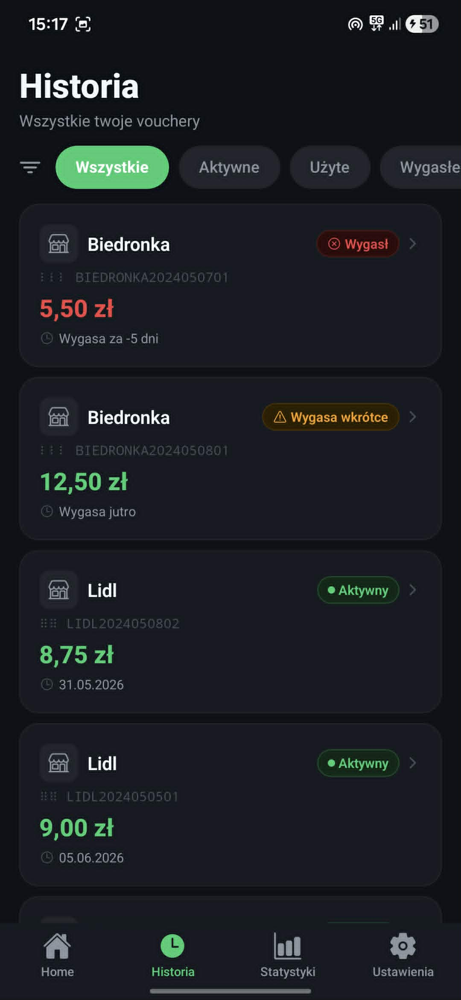
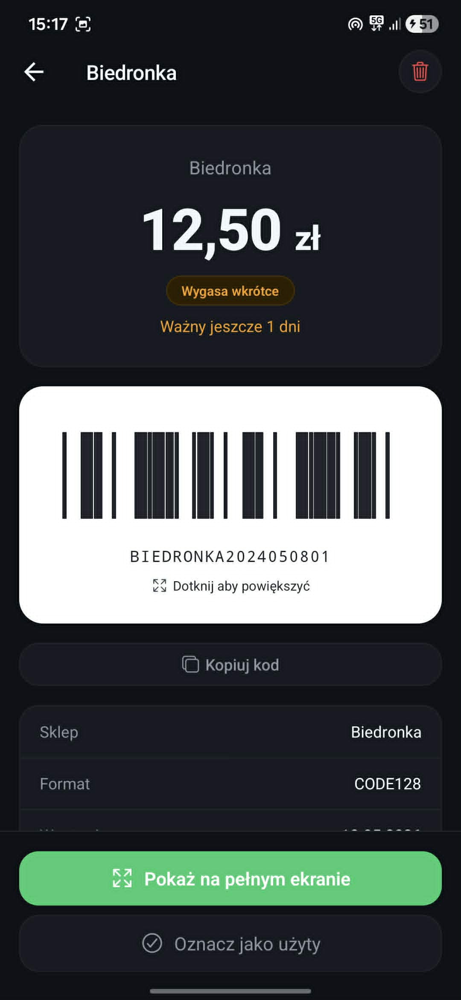
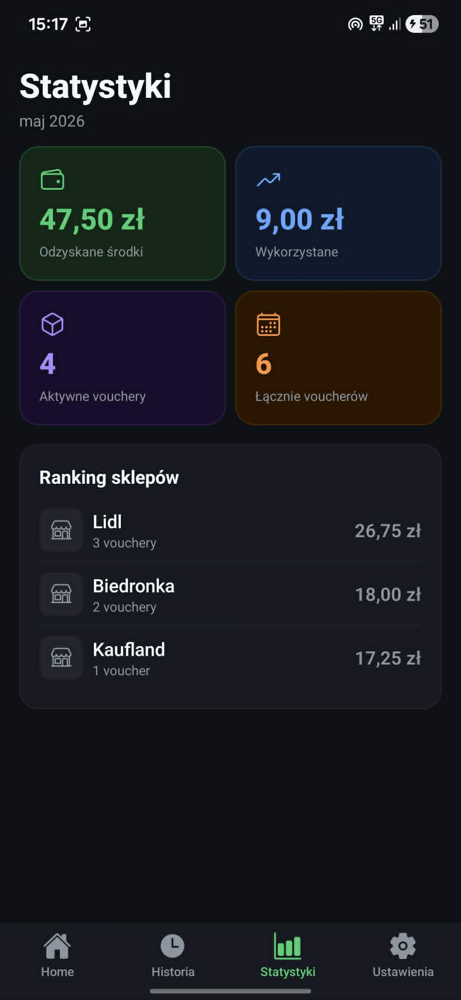

# Zwrotka v2

Nowoczesna aplikacja mobilna stworzona w **Expo / React Native**, rozwijana jako druga wersja projektu Zwrotka. Repozytorium zawiera kod źródłowy aplikacji, assety oraz konfigurację potrzebną do uruchomienia projektu lokalnie i budowania kolejnych wersji. 

## O projekcie

Zwrotka v2 to mobilna aplikacja rozwijana w oparciu o nowoczesny stack frontendowy. Projekt został przygotowany z myślą o dalszym rozwoju, testowaniu kolejnych funkcji oraz wygodnym uruchamianiu na Androidzie.

W repozytorium znajdują się:
- kod aplikacji w folderze `src`
- zasoby graficzne w folderze `assets`
- konfiguracja Expo i EAS
- screeny prezentujące wygląd aplikacji

## Stack technologiczny

Projekt korzysta z:
- TypeScript
- React Native
- Expo
- EAS Build

## Instalacja lokalna

Aby uruchomić projekt lokalnie:

```bash
git clone https://github.com/CichockiAdrian/zwrotka-v2.git
cd zwrotka-v2
npm install
npm start
```

Następnie możesz uruchomić aplikację w Expo Go albo na emulatorze / urządzeniu testowym.

## Pobieranie APK

Gotową wersję aplikacji na Androida będzie można pobrać w zakładce **Releases** tego repozytorium:

[Releases](https://github.com/CichockiAdrian/zwrotka-v2/releases)

W kolejnych wydaniach będą tam dodawane pliki APK do bezpośredniego pobrania i instalacji.

## Zrzuty ekranu

### Ekran 1


### Ekran 2


### Ekran 3


### Ekran 4


## Struktura projektu

```bash
.
├── assets
├── src
├── app.json
├── eas.json
├── package.json
└── tsconfig.json
```

## Status

Projekt jest aktywnie rozwijany. Kolejne aktualizacje, poprawki i nowe buildy będą publikowane w repozytorium.

## Autor

Projekt rozwijany przez [CichockiAdrian](https://github.com/CichockiAdrian).
